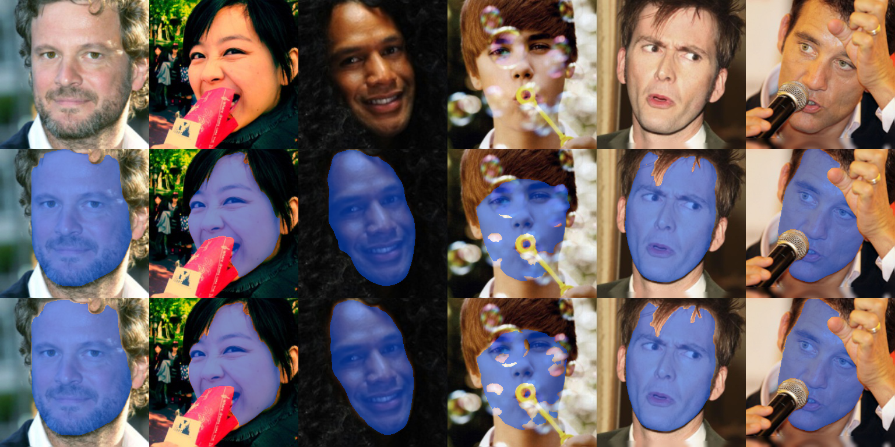

# FaceExtraction

[FaceOcc: A Diverse, High-quality Face Occlusion Dataset for Human Face Extraction](https://arxiv.org/pdf/2201.08425.pdf)

Our paper is accepted by [TAIMA 2022](http://www.arts-pi.org.tn/TAIMA2020/)

> Occlusions often occur in face images in the wild, troubling face-related tasks such as landmark detection, 3D reconstruction, and face recognition. It is beneficial to extract face regions from unconstrained face images accurately. However, current face segmentation datasets suffer from small data volumes, few occlusion types, low resolution, and imprecise annotation, limiting the performance of data-driven-based algorithms. This paper proposes a novel face occlusion dataset with manually labeled face occlusions from the CelebA-HQ and the internet. The occlusion types cover sunglasses, spectacles, hands, masks, scarfs, microphones, etc. To the best of our knowledge, it is by far the largest and most comprehensive face occlusion dataset. Combining it with the attribute mask in CelebAMask-HQ, we trained a straightforward face segmentation model but obtained SOTA performance, convincingly demonstrating the effectiveness of the proposed dataset. 

# Requirements
* PyTorch > 1.6.0
* [Segmentation Models](https://github.com/qubvel/segmentation_models.pytorch)
* PIL
* cv2
* numpy 

# How to use 
1. Download CelebAMask-HQ dataset, detect the facial landmarks using [3DDFAv2](https://github.com/cleardusk/3DDFA_V2)
2. Specify the directories in `face_align/process_CelebAMaskHQ.py`
3. Run `face_align/process_CelebAMaskHQ.py` to generate&align CelebAMask-HQ images and masks
4.Download FaceOcc and put it under Dataset directory
5.Run train.py

# Dataset 
[FaceOcc](https://drive.google.com/drive/folders/1K_V0AwhLT_TfHUny9sMA5PZ9KmEQSy05?usp=sharing)

# Pretrained Model
[Pretrained Model](https://drive.google.com/file/d/11cOc1KJnkR6hNp1l0vnMmCDxGTOCtsEb/view?usp=sharing)

# Results
Face masks are shown in blue. From top to bottom are input images, predicted masks, and the ground truth: 



# Related Works
* **CelebA** dataset:<br/>
Ziwei Liu, Ping Luo, Xiaogang Wang and Xiaoou Tang, "Deep Learning Face Attributes in the Wild", in IEEE International Conference on Computer Vision (ICCV), 2015 
* **CelebA-HQ** was collected from CelebA and further post-processed by the following paper :<br/>
Karras et. al, "Progressive Growing of GANs for Improved Quality, Stability, and Variation", in Internation Conference on Reoresentation Learning (ICLR), 2018
* **CelebAMask-HQ** dataset:<br />
Lee, Cheng-Han and Liu, Ziwei and Wu, Lingyun and Luo, Ping, "Maskgan: Towards diverse and interactive facial image manipulation", in IEEE/CVF Conference on Computer Vision and Pattern Recognition (CVPR), 2020


# Dataset Agreement
* The FaceOcc dataset is available for **non-commercial research purposes** only.
* You agree **not to** reproduce, duplicate, copy, sell, trade, resell or exploit for any commercial purposes, any portion of the images and any portion of derived data.
* You agree **not to** further copy, publish or distribute any portion of the CelebAMask-HQ dataset. Except, for internal use at a single site within the same organization it is allowed to make copies of the dataset.


# License and Citation
The use of this software is RESTRICTED to **non-commercial research and educational purposes**.

If you use our dataset, please cite it as: 

>Xiangnan YIN, Liming Chen, “FaceOcc: A Diverse, High-quality Face Occlusion Dataset for Human Face Extraction”, Traitement et Analyse de l’Information Méthodes et Applications (TAIMA’2022), 28 May-02 June 2022, Hammamet, Tunisia, ArXiv : 2201.08425. HAL : hal-03540753.

or

```
@inproceedings{yin2022faceocc,
  title={FaceOcc: A Diverse, High-quality Face Occlusion Dataset for Human Face Extraction},
  author={Yin,Xiangnan and Chen, Liming},
  booktitle={Traitement et Analyse de l’Information Méthodes et Applications (TAIMA’2022), 28 May-02 June 2022, Hammamet, Tunisia},
  pages={1--10},
  year={2022}
  
}


```
